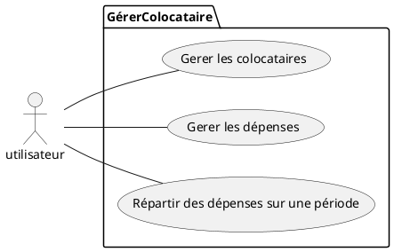
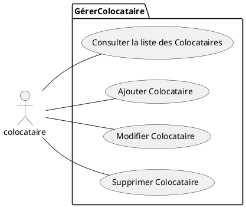
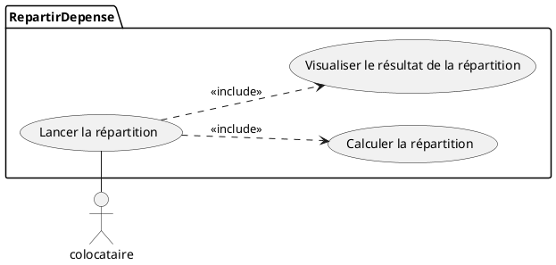

# Application Colocation CROUS
## Fonctionnement : 
L'Application du CROUS pour une colocataion permet de :
* Gerer des Colocataires
* Gerer des Dépenses
* Répartir Des Dépenses sur une Période

<br></br>
### Voici les tables de la base de donnée qu'utilisera l'application :
```sql
drop database if exists dbcrous;
create database dbcrous;
use dbcrous;
```
```sql
CREATE TABLE Colocataire (
	id int(11) unsigned not null auto_increment,
	nom VARCHAR(50),
	prenom VARCHAR(50),
	mail varchar(50),
	telephone varchar(20),
	primary key (id)
	);
```
```sql
CREATE TABLE Depense(
	id int(11) unsigned not null auto_increment,
	ladate DateTime,
	texte Varchar(50),
    justificatif varchar (256),
    montant Decimal(10,2),
    reparti boolean,
    idColoc int(11) unsigned not null,
	Primary key (id),
    Foreign key (idColoc) REFERENCES Colocataire(id)
	);
```

Voici l'interface permettant d'accéder aux différentes fonctionnalités :



<br></br>

## **Gerer les colocataires :**
---

<br></br>

Voici l'interface permettant de consulter la liste des colocataires et permettant d'ajouter, modifier ou encore de supprimer un colocataire :


<br></br>

### AJOUT COLOCATAIRE :

On peut donc Ajouter des colocataires en appuyant sur le bouton Ajouter nous redirigeant vers une nouvelle fenêtre : 


Si une des informations entrées ne sont pas correctes, la page ne se fermera pas attendant ainsi les bonnes informations :


<br></br>

### MODIFICATION COLOCATAIRE :
On peut également modifier les informations d'un colocataire en appuyant sur le bouton Modifier. Attention il faut sélectionner un colocataire avant d'appuyer sur Modifier.


nous redirigeant ainsi vers une nouvelle fenêtre :


Si une des informations entrées ne sont pas correctes, la page ne se fermera pas attendant ainsi les bonnes informations :


<br></br>

### SUPPRESSION COLOCATAIRE :

Il est aussi possible de supprimer un colocataire, pour cela il faut sélectionner le colocataire puis appuyer sur Supprimer.


<br></br>

### REINITIALISER LES COLOCATAIRES :
Enfin, on peut supprimer tous les colocataires en une fois grâce au bouton Réinitialiser :


<br></br><br></br>
**ATTENTION :**  
Il faut à chaque action effectuée, appuyer sur Enregistrer pour pouvoir sauvegarder ce qui a pu être fait.


<br></br>

## **Gerer les dépenses :**
---



<br></br>

### AJOUT DEPENSE :


<br></br>

### MODIFICATION DEPENSE :
En cas d'erreur ou autres, les informations comme la date, le texte, le montant ou encore le fichier justificatif peuvent être modifiés.


<br></br>

### SUPPRESSION DEPENSE :
Il suffit de sélectionner la dépense et de cliquer sur le bouton Supprimer

<br></br>

### REINITIALISER LES DEPENSES :
Enfin, on peut supprimer toutes les dépenses en une fois grâce au bouton Réinitialiser :


<br></br>

### ENREGISTRER DEPENSE :
Cliquer sur le bouton Enregistrer après chaque action


<br></br>

## **Répartir les dépenses sur une période :**
---
Cette fonctionnalité permet de calculer ce que chaque personne doit aux autres colocataires par rapport aux dépenses faites pour la colocation.


On appuie donc sur le bouton Lancer la Répartition pour être rediriger vers une nouvelle fenêtre :


On peut voir sur le tableau de gauche les dépenses qui n'ont pas encore été réparties. En effet on pouvait voir dans le tableau de la fenêtre Gerer Depense que les dépenses étaint au nombre de trois :

Or on a ici dans le tableau des répartition, deux dépenses. Cela signifie qu'une des trois dépenses a déja été réparties:
 

<br></br>
En appuyant sur le bouton Répartir, nous obtiendrons sur le tableau de droite : la somme que doit régler chaque colocataire par rapport à ses dépenses faites pour la colocation.
 

### Explication :  
Jean a acheté un fauteuil d'une valeur de 50€.  
Tandis que Paul a acheté une table d'une valeur de 46€.  
Le total des dépenses faites pour la colocation s'élève ici à 96€.  
Il faut donc que chaque colocataire se partage cette somme. Ici chacun doit payer 48€.  
Jean ayant payé plus que 48€ et Paul ayant payé moins, devra donner 2€ à Jean pour que celui obtienne compensation.
<br></br>

Les répartitions étant faites, ces dépenses ne s'afficheront désormais plus dans ce tableau et leur valeur dans la base de donnée indiquera 1(True) :


Et on ne pourra désormais pas répartir des dépenses tant que de nouvelles dépenses n'ont pas été faites :


<br></br><br></br>

Enfin, nous pouvons réinitialiser l'application entière, supprimant ainsi tous les colocataires ainsi que toutes les dépenses.
.PNG