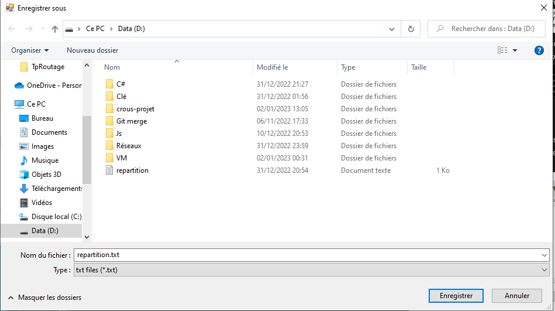
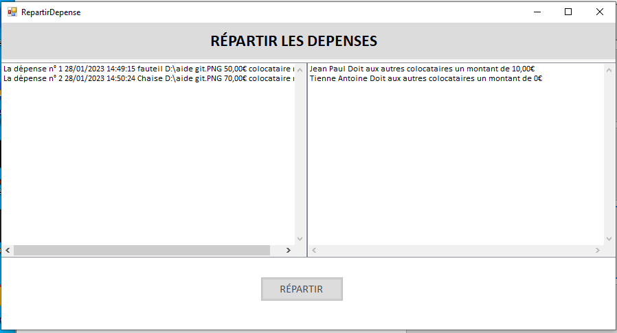

# Application Colocation CROUS

Prérequis :

Il est nécessaire d'installer le connector/net (https://dev.mysql.com/downloads/file/?id=515908), pour de l'ado.net.

Il faudra ajouter la référence suivante  au projet :

Dans vs :


je fais un clique droit sur Dao et clique sur référence.

Je clique sur parcourir : 


Je choisis la référence suivante :


Merci de respecter l'arborescence du fichier sinon risque d'érreur.

Regénérer le projet.

## Contexte : 
L'application du CROUS permet aux étudiants de gérer les dépenses d'une colocation :


</br>


<br></br>

### Voici les tables de la base de donnée qu'utilisera l'application :
```sql
drop database if exists dbcrous;
create database dbcrous;
use dbcrous;
```
```sql
CREATE TABLE Colocataire (
	id int(11) unsigned not null auto_increment,
	nom VARCHAR(50),
	prenom VARCHAR(50),
	mail varchar(50),
	telephone varchar(20),
	primary key (id)
	);
```
```sql
CREATE TABLE Depense(
	id int(11) unsigned not null auto_increment,
	ladate DateTime,
	texte Varchar(50),
    justificatif varchar (256),
    montant Decimal(10,2),
    reparti boolean,
    idColoc int(11) unsigned not null,
	Primary key (id),
    Foreign key (idColoc) REFERENCES Colocataire(id)
	);
```
## **Menu :**
---
Voici l'interface principale permettant d'accéder aux différentes fonctionnalités :


<br></br>

## **Gerer les colocataires :**
---


Voici l'interface permettant de consulter la liste des colocataires et permettant d'ajouter, modifier ou encore de supprimer un colocataire :


</br>

### AJOUT COLOCATAIRE :

On peut donc Ajouter des colocataires en appuyant sur le bouton Ajouter nous somme redirigées vers une nouvelle fenêtre : 


Si une des informations entrées ne sont pas correctes, la page ne se fermera pas attendant ainsi les bonnes informations :


### MODIFICATION COLOCATAIRE :
On peut également modifier les informations d'un colocataire en appuyant sur le bouton Modifier. Attention il faut sélectionner un colocataire avant d'appuyer sur Modifier.


nous redirigeant ainsi vers une nouvelle fenêtre :


Si une des informations entrées ne sont pas correctes, les informations saisies ne pourront être validées:


</br>

### SUPPRESSION COLOCATAIRE :

Il est aussi possible de supprimer un colocataire, pour cela il faut sélectionner le colocataire puis appuyer sur Supprimer.


</br>

**ATTENTION :**  
Il faut à chaque action effectuée, appuyer sur Enregistrer pour pouvoir sauvegarder ce qui a pu être fait.


### RÉINITIALISER LES COLOCATAIRES :
Enfin, on peut supprimer tous les colocataires en une fois grâce au bouton Réinitialiser :


<br></br>

## **Gérer les dépenses :**
---
Voici l'interface permettant de consulter la liste des dépenses et permettant d'ajouter, modifier ou encore de supprimer une dépense :


<br></br>

### AJOUT DEPENSE :
Des controlleurs de saisie sont présent pour l'ensemble des champs.


<br></br>

### MODIFICATION DEPENSE :
En cas d'erreur ou autres, les informations comme la date, le texte, le montant ou encore le fichier justificatif peuvent être modifiés.


<br></br>

### SUPPRESSION DEPENSE :
Il suffit de sélectionner la dépense et de cliquer sur le bouton Supprimer même principe que pour les colocataires.

<br></br>

### REINITIALISER LES DEPENSES :
Enfin, on peut supprimer toutes les dépenses en une fois grâce au bouton Réinitialiser :


### ENREGISTRER DEPENSE :
Cliquer sur le bouton Enregistrer après chaque action.


<br></br>

## **Répartir les dépenses sur une période :**
---
Cette fonctionnalité permet de calculer ce que chaque personne doit aux autres colocataires par rapport aux dépenses faites pour la colocation.


On appuie donc sur le bouton Lancer la Répartition pour être rediriger vers une nouvelle fenêtre :


On peut voir sur le tableau de gauche les dépenses qui n'ont pas encore été réparties. En effet on pouvait voir dans le tableau de la fenêtre Gerer Depense que les dépenses étaint au nombre de deux :


Dans le SGBD nous pouvons voir que la colonne reparti est à 0 donc false :

 

<br></br>
En appuyant sur le bouton Répartir, l'explorateur de fichier s'ouvrira pour sauvegarder la répartition, l'étudiant a la possiblité d'enregistrer la répartiton dans un fichier.



Le contenu du fichier :


 Nous obtiendrons sur le tableau de droite, la somme que doit régler chaque colocataire par rapport à ses dépenses faites pour la colocation.

 


### Explication :  

Jean a acheté un fauteuil d'une valeur de 50€.  
Tandis que Antoine a acheté une chaise d'une valeur de 70€.  
Le total des dépenses faites pour la colocation s'élève ici à 120€.  
Il faut donc que chaque colocataire se partage cette somme. Ici chacun doit payer 60€.  
Antoine ayant payé plus de 60€ et Jean ayant payé moins, devra donner 10€ à Antoine pour qu'il sa obtienne sa compensation.
<br></br>

La répartition étant faites, ces dépenses ne s'afficheront désormais plus dans ce tableau et dans le sgbd reparti sera désormais à  1(True) :


On ne pourra répartir des dépenses tant que de nouvelles dépenses pour la colocation n'ont pas été faites :


</br>

Enfin, nous pouvons réinitialiser l'application entière, supprimant ainsi tous les colocataires ainsi que toutes les dépenses.


## E5 entrainement :

Pour préparer l'épreuve de fin d'année l'e5 le professeur ma demander d'ajouter à mon application, des fonctionnalités supplémentaire qui permettent à un colocataire de trier les dépenses, dans l'ordre en fonction atttribut de son choix et d'afficher le montant total des dépenses.


Exemple tri par montant :


