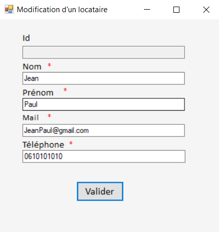
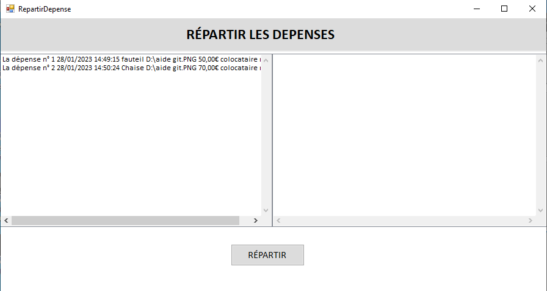

# Application Colocation CROUS

Prerequisites :

To run this project, you need to install the connector/net (https://dev.mysql.com/downloads/file/?id=515908), for ADO.NET.

You must also add the following reference to the project :

In Visual Studio :


Right-click on `Dao` and click on `Reference`.

Click on `parcourir` : 


Select the following reference :


Make sure to follow the directory structure correctly to avoid errors.

Rebuild the project.

## Contexte : 
The CROUS application helps students manage the expenses of a shared apartment :


</br>


<br></br>

### Database Tables Used by the Application :

```sql
drop database if exists dbcrous;
create database dbcrous;
use dbcrous;
```
```sql
CREATE TABLE Colocataire (
	id int(11) unsigned not null auto_increment,
	nom VARCHAR(50),
	prenom VARCHAR(50),
	mail varchar(50),
	telephone varchar(20),
	primary key (id)
	);
```
```sql
CREATE TABLE Depense(
	id int(11) unsigned not null auto_increment,
	ladate DateTime,
	texte Varchar(50),
    justificatif varchar (256),
    montant Decimal(10,2),
    reparti boolean,
    idColoc int(11) unsigned not null,
	Primary key (id),
    Foreign key (idColoc) REFERENCES Colocataire(id)
	);
```
## **Menu :**
---
Here is the main interface allowing access to the various features :


<br></br>

## **Gerer les colocataires :**
---


Here is the interface allowing you to view the list of colocataires and to add, modify, or delete a colocataire :


</br>

### AJOUT COLOCATAIRE :

Here is the interface allowing you to view the list of colocataires and to add, modify, or delete a colocataire : 


If any of the entered information is incorrect, the page will not close until valid information is provided :


### MODIFICATION COLOCATAIRE :

You can also modify a colocataire's information by clicking on the "Modify" button. Be sure to select a colocataire before clicking "Modifier".


This will redirect you to a new window :



If any of the entered information is incorrect, the details cannot be validated :


</br>

### SUPPRESSION COLOCATAIRE :

You can delete a colocataire by selecting the colocataire and clicking on "Supprimer".


</br>

**Note :**  

For every action, make sure to click "Enregistrer"  to save your changes.


### RÉINITIALISER LES COLOCATAIRES :

You can reset all colocataires at once by clicking the "Réinitialiser" button :


<br></br>

## **Gérer les dépenses :**
---

Here is the interface to view and manage the expenses, allowing you to add, modify, or delete an expense :


<br></br>

### AJOUT DEPENSE :

Input controllers are present for all fields.


<br></br>

### MODIFICATION DEPENSE :

In case of errors or updates, details like date, text, amount, or the supporting file can be modified.


<br></br>

### SUPPRESSION DEPENSE :

Simply select the expense and click the "Supprimer" button, similar to how you delete colocataires.
<br></br>

### REINITIALISER LES DEPENSES :

You can reset all expenses at once by clicking the "Réinitialiser" button :


### ENREGISTRER DEPENSE :

Click the "Enregistrer" button after each action.


<br></br>

## **Répartir les dépenses sur une période :**
---
This feature allows you to calculate what each colocataire owes the others based on the expenses incurred for the shared apartment.


Click on the "Lancer la Répartition" utton to be redirected to a new window :



On the left side, you'll see the expenses that haven't been distributed yet. For example, in the "Gerer Depenses" window, there were two expenses :


In the database, we can see that the "reparti" column is set to 0 (false) :

 

<br></br>
By clicking on "Répartir"  the file explorer will open to save the distribution, allowing the student to store the distribution in a file.


The file content :


 On the right side of the table, you'll see the amount that each colocataire owes based on their contributions to the shared apartment.

 


### Explication :  

Jean bought a chair worth €50, and Antoine bought a chair worth €70.
The total expenses for the shared apartment are €120.
Each colocataire should pay €60.
Since Antoine paid more than €60 and Jean paid less, Jean will owe Antoine €10 to balance the payments.
<br></br>

Once the distribution is done, these expenses will no longer appear in the table, and in the database, the "reparti" value will be set to 1 (True) :


You won't be able to distribute expenses until new expenses are added for the shared apartment :


</br>

Finally, you can reset the entire application, deleting all colocataires and expenses.


## E5 Training :

To prepare for the year-end exam (E5), the professor asked me to add new features that allow a colocataire to sort expenses based on their chosen attribute and display the total amount of expenses.


Example sorting by amount :


